# A Complete ETL and Business Intelligence Project on Telco Customer Churn

From Data Extraction with the Kaggle API to Descriptive Dashboards and Predictive Modeling in AWS Using Python, S3, and QuickSight

## Table of Contents
- [Overview](#overview)
- [Tools and Technologies](#tools-and-technologies)
- [Project Structure](#project-structure)
- [ETL Process](#etl-process)
- [Descriptive Analysis](#descriptive-analysis)
- [Predictive Analysis](#predictive-analysis)
- [AWS Integration](#aws-integration)
- [Final Deliverables](#final-deliverables)
- [How to Run Locally](#how-to-run-locally)

## Overview

This project explores customer churn in a telecom company using a full-stack BI approach:

- Extracted data from Kaggle using CLI
- Transformed and engineered features in Python
- Conducted descriptive analysis in AWS QuickSight
- Built and evaluated predictive models in Python
- Uploaded results to S3 and visualized predictions

## Tools and Technologies

- **Languages**: Python (Pandas, Scikit-learn)
- **Cloud**: AWS S3, AWS QuickSight
- **Data Source**: Kaggle (Telco Customer Churn)
- **Visualization**: AWS QuickSight
- **Version Control**: Git & GitHub

## Project Structure

```
telco_churn_project/
│
├── data/                      # Raw and cleaned CSVs
├── scripts/                   # Python scripts for preprocessing and modeling
├── Visuals/                   # All generated visualizations
└── README.md                  # Project summary and insights
```

## ETL Process

- Loaded Telco churn data via Kaggle API
- Cleaned missing values and formatted categories
- Engineered tenure groups, monthly charge bins
- Saved transformed dataset as `clean_telco.csv`

## Descriptive Analysis

### Churn by Contract Type

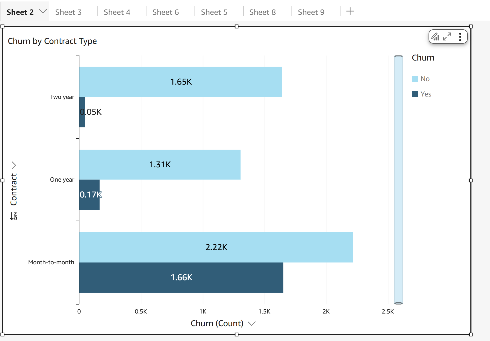

- Month-to-month: **1.66K churned**, **2.22K stayed**
- One-year: **0.17K churned**, **1.31K stayed**
- Two-year: **0.05K churned**, **1.65K stayed**

### Churn by Internet Service

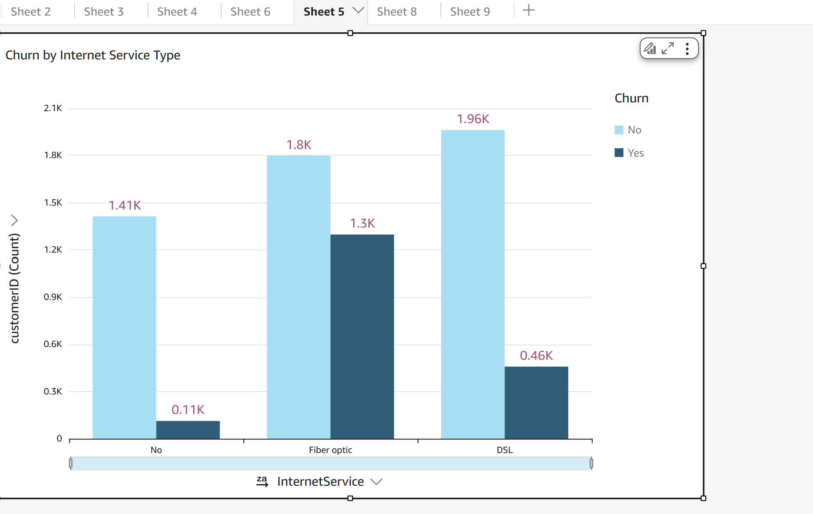

- Fiber Optic: **1.3K churned**, **1.8K stayed**
- DSL: **0.46K churned**, **1.96K stayed**
- No Internet: **0.11K churned**, **1.41K stayed**

### Churn by Tenure Group

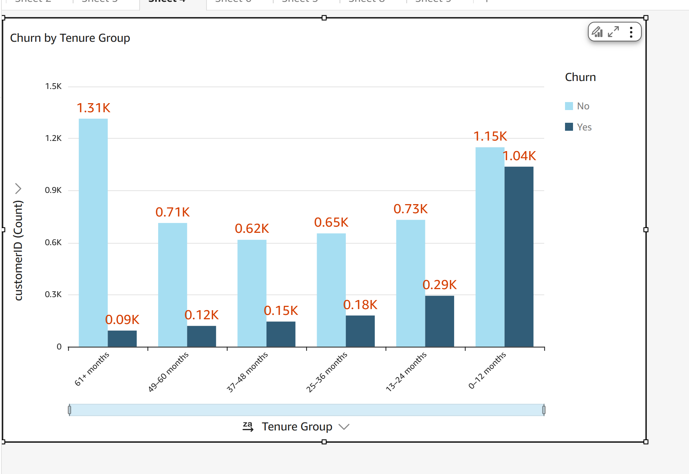

- **0–12 months**: **1.04K churned**, **1.15K stayed**
- **13–24 months**: **0.29K churned**, **0.73K stayed**
- **61+ months**: only **0.09K churned**, while **1.31K stayed**

### Churn by Monthly Charges

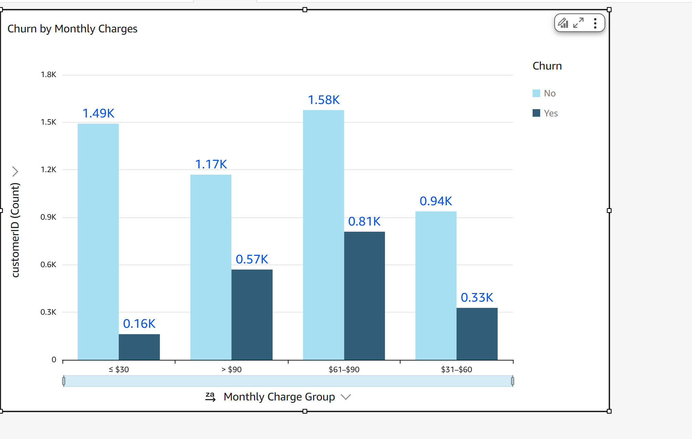

- **$61–$90**: **0.81K churned**, **1.58K stayed**
- **> $90**: **0.57K churned**, **1.17K stayed**
- **<= $30**: **0.16K churned**, **1.49K stayed**

### Churn Percent by Contract & Gender

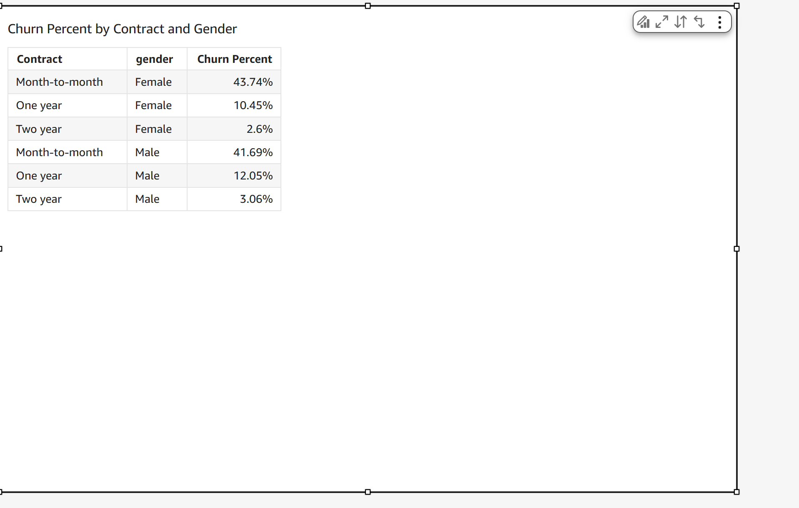

- Female Month-to-month: **43.74% churn**
- Male Month-to-month: **41.69% churn**
- Lowest churn: Two-year contracts — **2.6% (Female)** and **3.06% (Male)**

### Churn by Payment Method

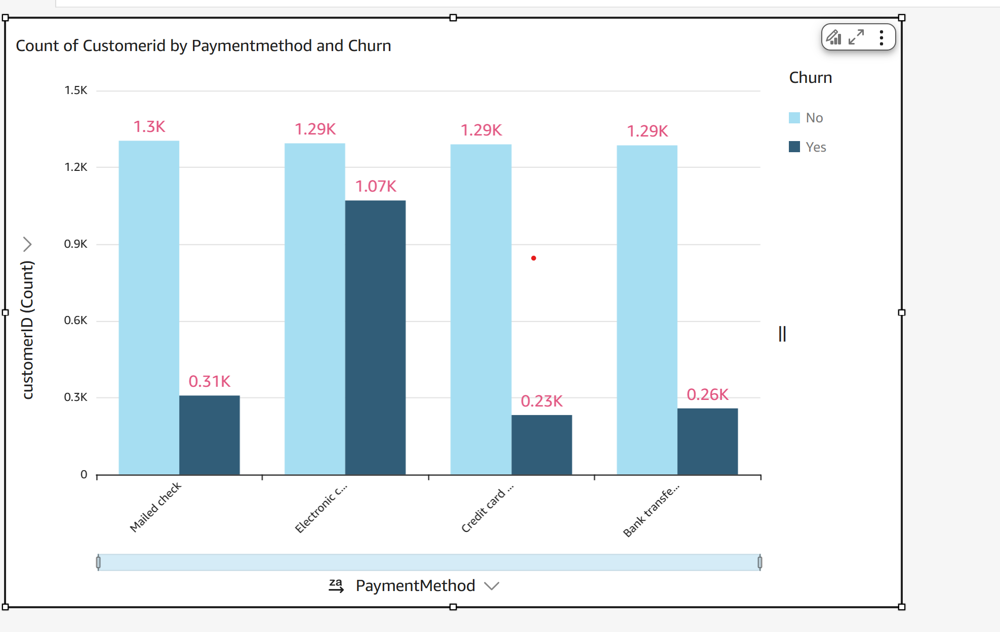

- **Electronic Check** had the highest churn: **1.07K churned**, **1.29K stayed**
- Other methods like Mailed Check, Credit Card, and Bank Transfer had much lower churn (around 0.23K–0.31K)

## Predictive Analysis

### Predicted Churn by Contract Type

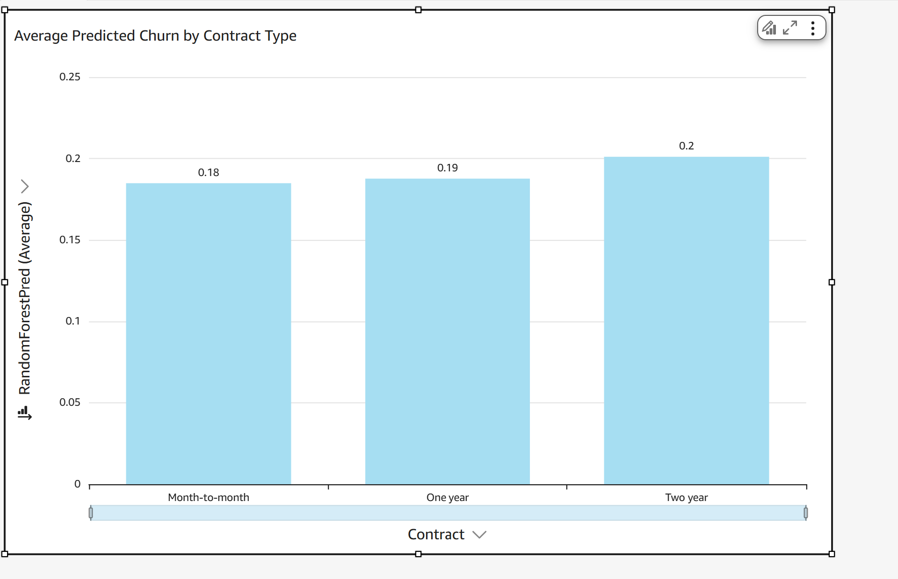

- Predicted churn (Random Forest):
  - Month-to-month: **0.18**
  - One-year: **0.19**
  - Two-year: **0.20**

### RF Predicted Churn by Monthly Group

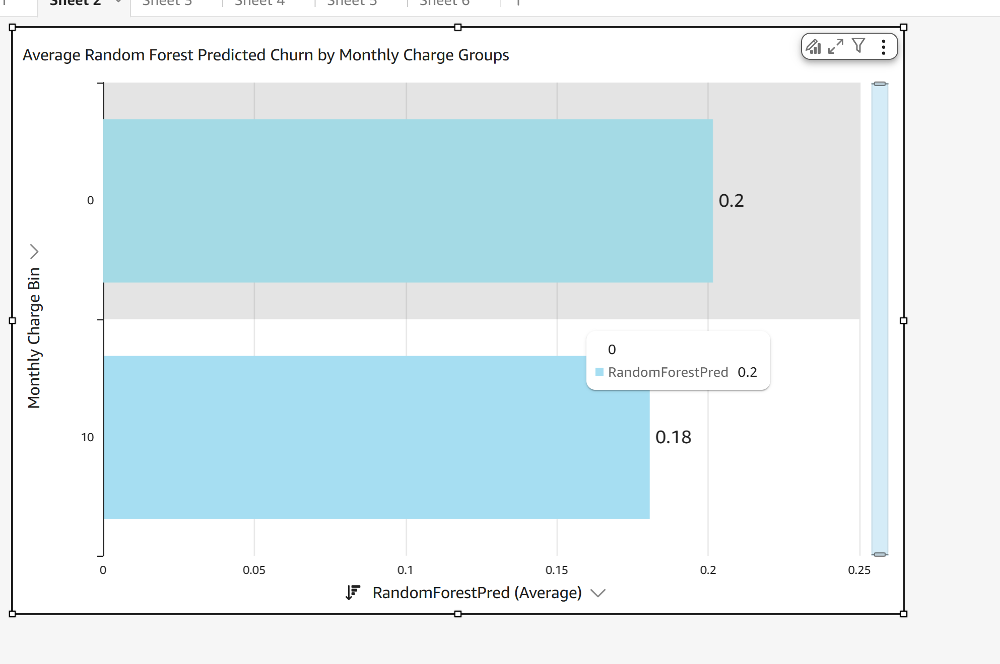

- Predicted churn:
  - Lower monthly charges: **0.18**
  - Higher charges: **0.20**

### RF Tenure Trend

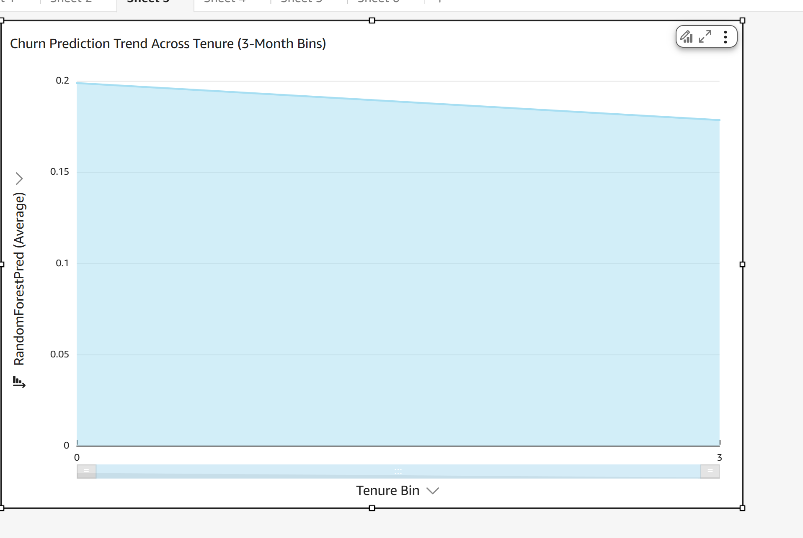

- Churn probability decreases steadily with tenure.
- Short-tenure bins have churn probability near **0.20**, while longer-tenure bins drop below **0.18**

### Confusion Matrix

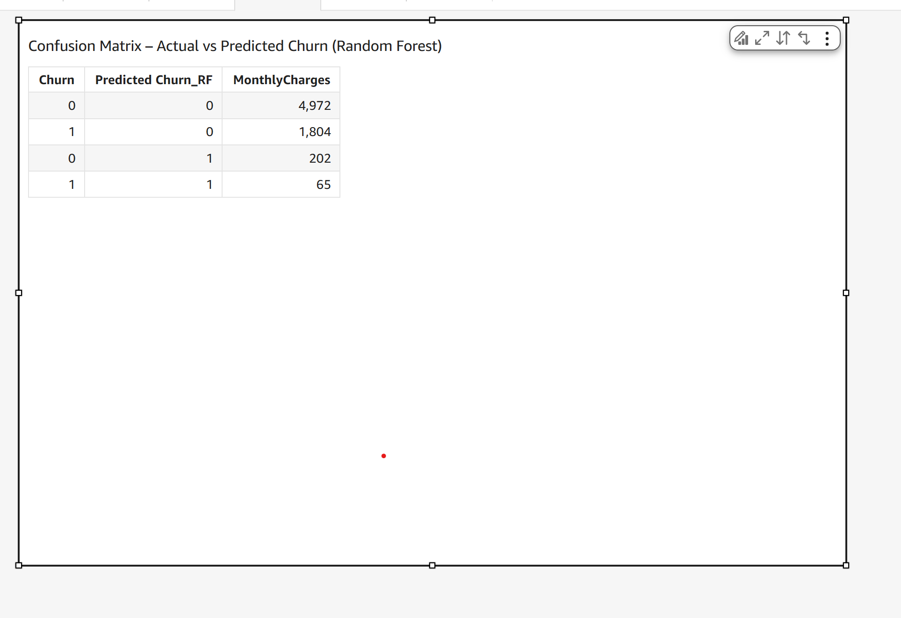

- True negatives: **4,972**
- False negatives (missed churn): **1,804**
- False positives: **202**
- True positives: **65**

### RF Internet Churn

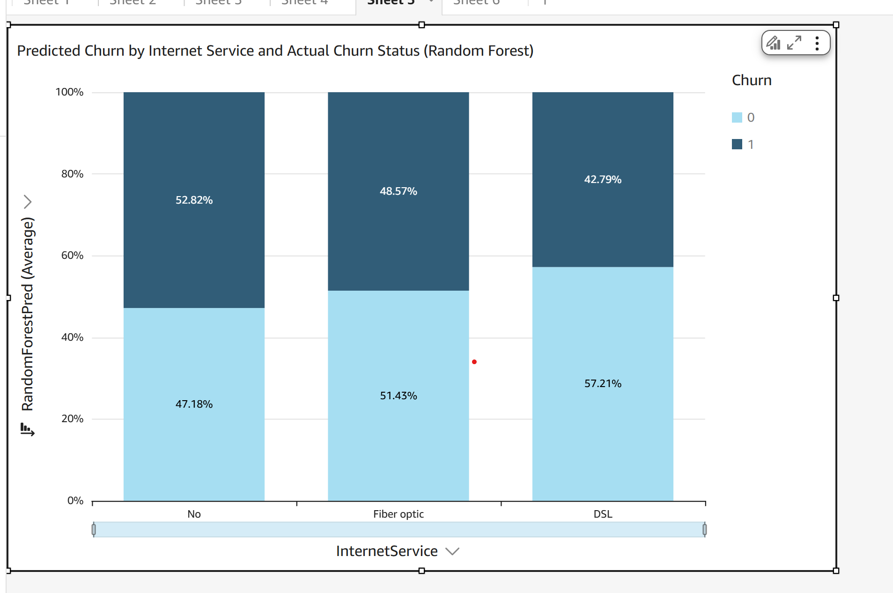

- DSL users: highest predicted churn (**57.21% stayed**, **42.79% churned**)
- Fiber Optic and No Internet show similar predicted vs actual patterns

## AWS Integration

- Cleaned data and model results were uploaded to **Amazon S3**
- All dashboards created in **Amazon QuickSight**
- Project replicable via CLI and cloud tools

## Final Deliverables

- ✅ Clean dataset
- ✅ Jupyter modeling script
- ✅ QuickSight dashboard visuals
- ✅ GitHub-ready documentation

## How to Run Locally

1. Clone the repo
2. Navigate to `scripts/` and run:
   ```bash
   python churn_modeling.py
   ```
3. Outputs will be saved in `/data` and `/Visuals`
4. Upload to AWS S3 or QuickSight as needed